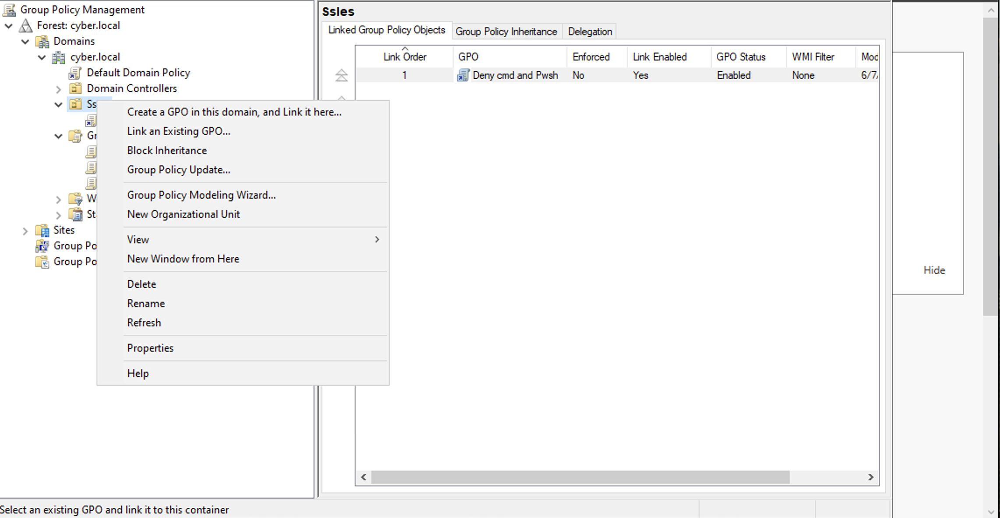
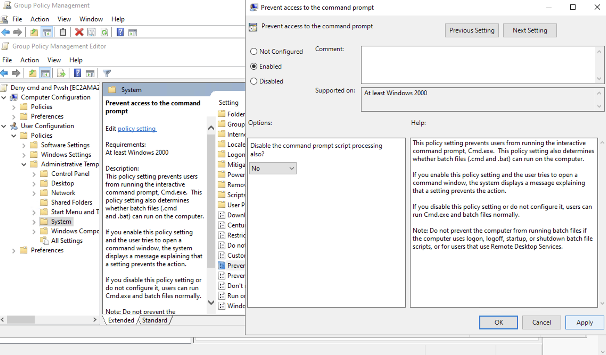
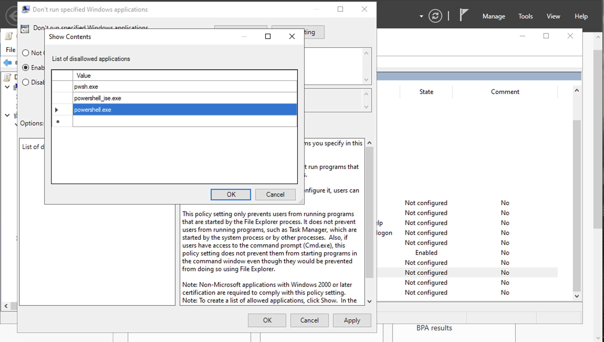

# How to Disable CMD and Powershell for Standard Users 🧱
-This lab ilustrates how to disable **CMD** and **Powershell** for certain users
### Step 1: Disabling CMD and Powershell for Standard Users
- In the **Group Policy Management** Navigate to the **Sales OU** -> Right Click on it -> Select **Create New GPO and Link it here**
- Since this is a **User** specific policy we are going to configure this policy setting is located under **User Configuration**

### Step 2:
- Navigate to **Administrative Templates** -> **System** -> and double click on the **Prevent access to the Command prompt**
- Click **Enabled** -> **Apply** -> and then hit **OK**

### Step 3:
- To Disable **Powershell and Powershell ISE** from being ran on the user account, underneath the same **Administrative Templates** folder, select the '**Don't run specified Windows Applications Applications**',-> **Enabled**, -> **Show**, -> and add the paths for **PowerShell**, and **PowerShell ISE**, -> **Apply**, and lastly hit **Ok**

## Demo Videos🎥
-[CMD Prompt Block Demo](https://www.loom.com/share/4c7c078a539b47d38c641aa7ae179477?sid=a47834ae-b705-4501-9e6c-eb661e66f344)

-[Powershell Block Demo](https://www.loom.com/share/7abdde281b4346ec8e629b274191a7ea?sid=37ec4e7c-a72a-4233-8236-bb3113bde284)

# Don't Forget!!
- In order for these policy changes to take effect, you need to remember to open **Command Prompt** and run the **gpupdate /force** command to enforce the new **Active Directory** policy changes.
